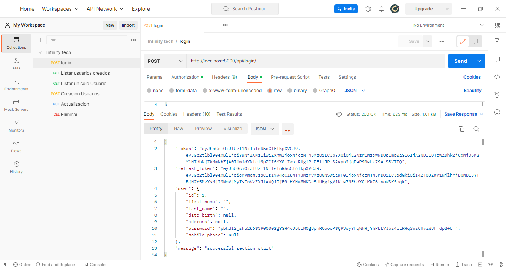
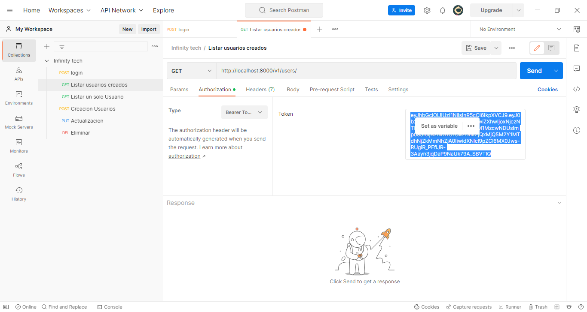
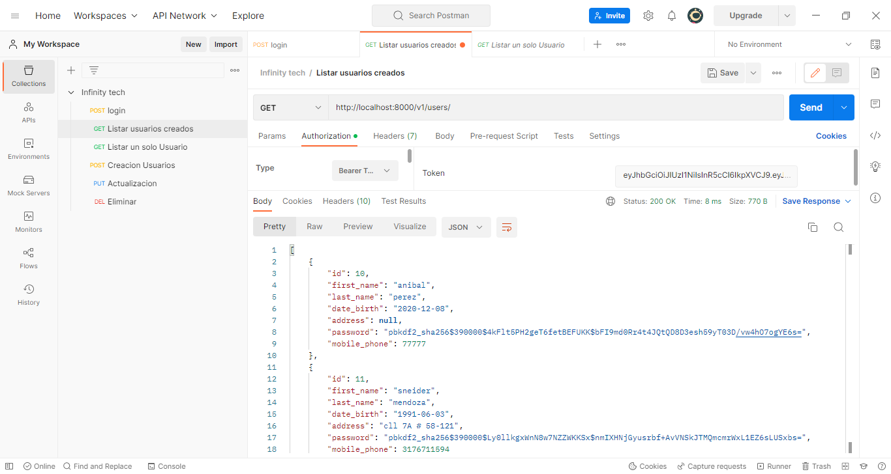
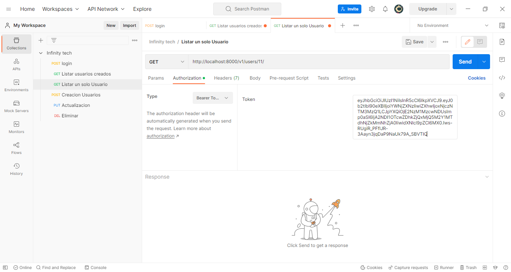
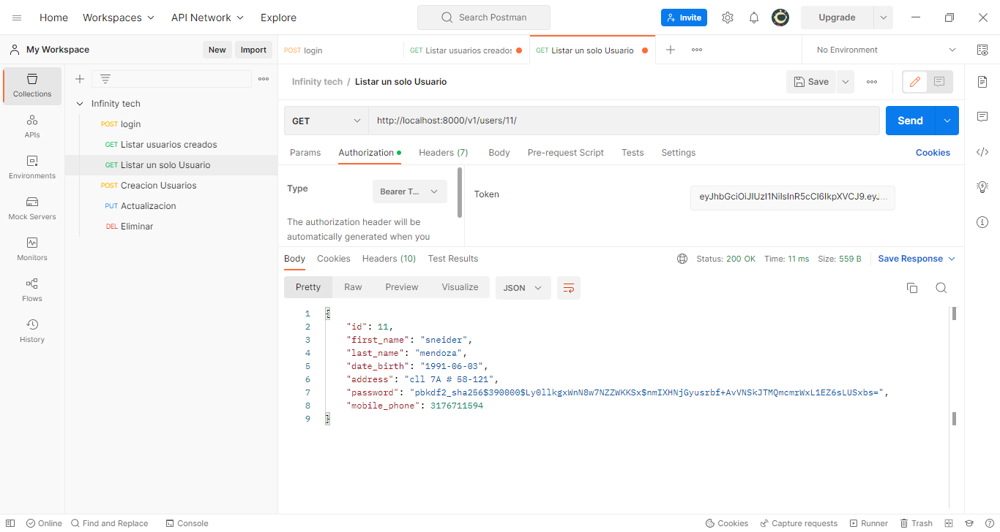
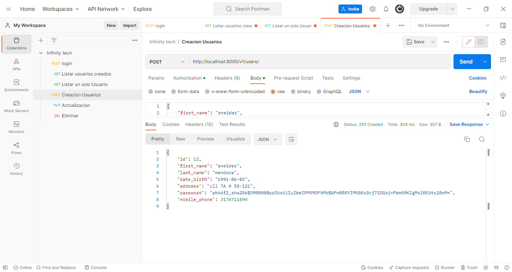
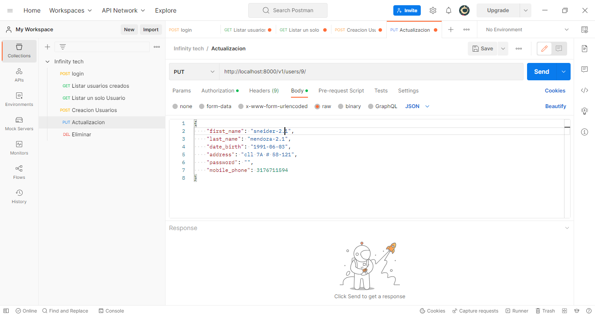
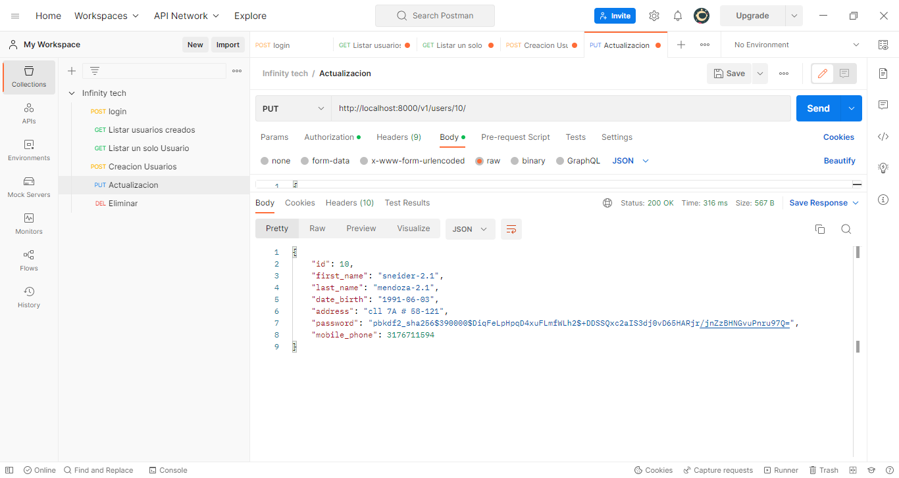
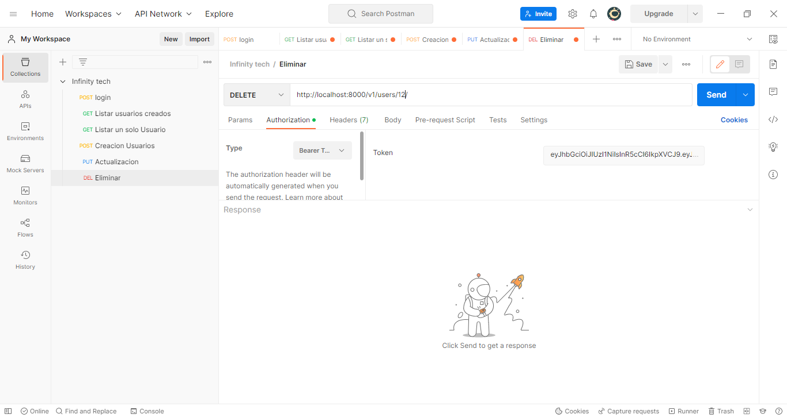
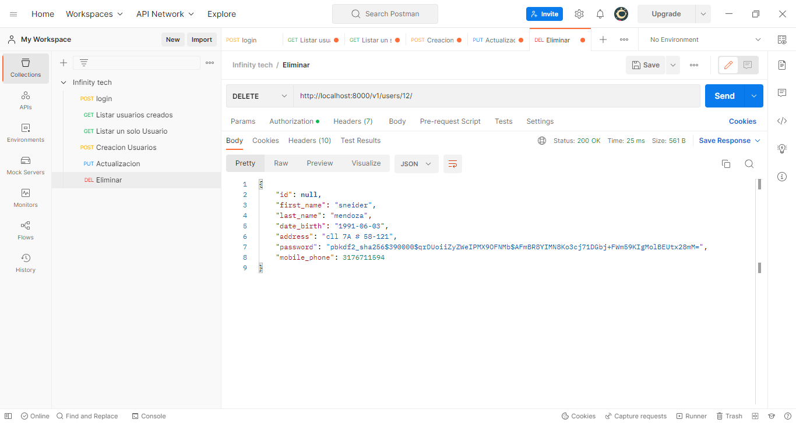

# Prueba Infinity Tech


**API para gestionar el acceso a la aplicación y así poder gestionar
el listar,crear,editar y eliminar  usuarios**


> *Despues de haber descargado de [GitHub](https://github.com/sneidermendoza/Prueba_infinity-tech "Infinity Tech")*  la carpeta que contiene los archivos, podemos abrir esa carpeta en un editor de codigo, ejemplo: Visual Studio Code

## Instalacion
1. Instalar [Python](https://www.python.org/downloads/ "Python")


2. Estando en nuestro editor de código favorito, podemos crear un entorno virtual para poder descargar las dependencias que van a hacer que nuestro proyecto funcione.
Estando situado en nuestro proyecto dentro del editor de código, abrimos una terminal y con el comando.

>**virtualenv -p python3 env**

Después hay que activar este entorno. Y lo hacemos con el comando 

>**.\env\scripts\activate**

Después de estar activado nuestro entorno virtual, vamos a instalar todas las dependencias de nuestro proyecto 
esto lo hacemos con el siguiente comando  

>**pip install**

aquí te dejo todas las dependencias.

> * asgiref==3.6.0
> * attrs==22.2.0
> * Django==4.1.5
> * djangorestframework==3.14.0
> * djangorestframework-simplejwt==5.2.2
> * drf-extensions==0.7.1
> * drf-spectacular==0.25.1
> * inflection==0.5.1
> * jsonschema==4.17.3
> * PyJWT==2.6.0
> * pyrsistent==0.19.3
> * pytz==2022.7
> * PyYAML==6.0
> * sqlparse==0.4.3
> * tzdata==2022.7
> * uritemplate==4.1.1

Un ejemplo de esto es: **pip install Django==4.1.5**
Con esto ya estamos listos para empezar a interactuar con nuestro proyecto


## Rutas
* [Login](http://localhost:8000/api/login/ "Login")
* [Listar](http://localhost:8000/v1/users/ "Listar")
* [Listar un usuario](http://localhost:8000/v1/users/1/ "Listar un usuario")
* [Crear](http://localhost:8000/v1/users/ "Crear")
* [Editar](http://localhost:8000/v1/users/1/ "Editar")
* [Eliminar](http://localhost:8000/v1/users/1/ "Eliminar")


## Login


> Habiendo corrido nuestro proyecto, lo Primero que hacemos es loguearnos con nuestro *username* y nuestro *password* en la ruta [Login](http://localhost:8000/api/login/ "Login"), mandándoles en el body y en formato JSON el username y el password de la siguiente manera


La respuesta que esto nos devolverá será un JSON con un token, refresh_token, usuario con sus datos y un mensaje





 Con el token dado de **login**, tendremos acceso a las rutas de listar, listar un *usuario*, *creación*, *edición* y *eliminación*.


## Listar


Para acceder a esta ruta [Listar](http://localhost:8000/v1/users/ "Listar") necesitamos el método **GET** y en **Autorización** un token de tipo **Bearer token** el cual nos lo provee el login.




Esto nos dará por respuesta, todos los usuarios que estén registrados en la base de datos.




## Listar un solo usuario


Para acceder a esta ruta [Listar un usuario](http://localhost:8000/v1/users/1/ "Listar un usuario") necesitamos el método **GET** en **Authorization** un token de tipo **Bearer token** el cual nos lo provee el login y en la ruta enviarle el **ID** del usuario a listar de la siguiente manera.




Esto nos dará por respuesta, el usuario solicitado.




## Crear

Para acceder a esta ruta [Crear](http://localhost:8000/v1/users/ "Crear") necesitamos el método **POST**, en **Authorization** un token de tipo **Bearer token** el cual nos lo provee el login, y en el **Body** y en formato **Json** estos datos.

 ```Json

 {


    "first_name" : "CharField()",

    "last_name" : "CharField()",

    "date_birth" : "DateField()",

    "address" : "CharField()",

    "password" : "CharField()",

    "mobile_phone" : "IntegerField()"

}

 ```

De la siguiente manera.


Esto nos dará por respuesta, el usuario creado con todos sus datos y la **password** encriptada.




## Editar

Para acceder a esta ruta [Editar](http://localhost:8000/v1/users/1/ "Editar") necesitamos el metodo **PUT**, en **Authorization** un token de tipo **Bearer token** el cual nos lo provee el login, en la ruta el **ID** del usuario que queremos editar y en el **Body** y en formato **JSON** con los datos a editar.

 ```Json

{


    "first_name": "sneider-2.1",

    "last_name": "mendoza-2.1",

    "date_birth": "1991-06-03",

    "address": "cll 7A # 58-121",

    "password": "544548",

    "mobile_phone": 3176711594

}

 ```

De la siguiente manera.





Esto nos dará por respuesta, el usuario editado con todos sus datos y la **password** encriptada.




## Eliminar


Para acceder a esta ruta [Eliminar](http://localhost:8000/v1/users/1/ "Eliminar") necesitamos el metodo **Delete** en **Authorization** un token de tipo **Bearer token** el cual nos lo provee el login y en la ruta enviarle el **ID** del usuario a eliminar de la siguiente manera.




Esto nos dará por respuesta, el usuario eliminado.

